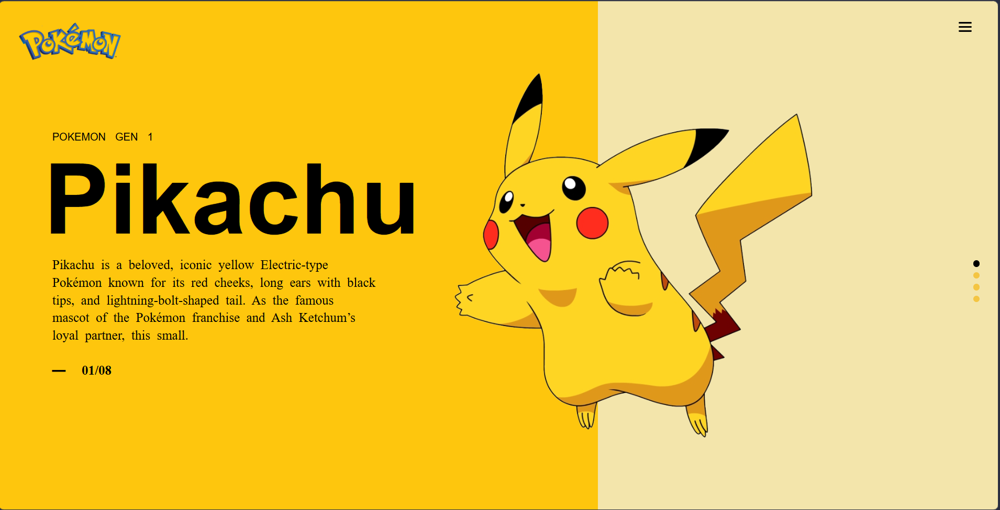

#  Pokémon UI Design (CSS Positioning Project)

##  Project Overview

This project is a UI recreation of a Pokémon-themed design (Pikachu) using **HTML and CSS**.

The main goal of this assignment was to understand and apply:

* CSS positioning (`relative`, `absolute`)
* Layout structuring
* Visual alignment
* Basic UI design concepts

---

##  Features

* Split screen layout (Left + Right section)
* Positioned Pikachu image using `position: absolute`
* Custom text styling and layout
* Top-right menu icon
* Vertical navigation dots (right side)
* Background Pokéball design element

---

## Technologies Used

* HTML5
* CSS3

---

## 🧠 Concepts Practiced

* `position: relative` & `position: absolute`
* Flexbox (for layout structure)
* Background images
* Spacing (margin, padding)
* Text styling
* Layering UI elements

---

## 📷 Preview



---

## Folder Structure

```
project-folder/
│── index.html
│── style.css
│── images
```

---

##  Learning Outcome

Through this project, I learned how to:

* Convert a design into code
* Position elements accurately
* Think in terms of UI structure
* Improve problem-solving and debugging skills

---

## Live / GitHub Link

(Add your GitHub repo link here)

---

## Acknowledgement

This project was completed as part of a frontend learning assignment to improve UI and CSS positioning skills.

---
